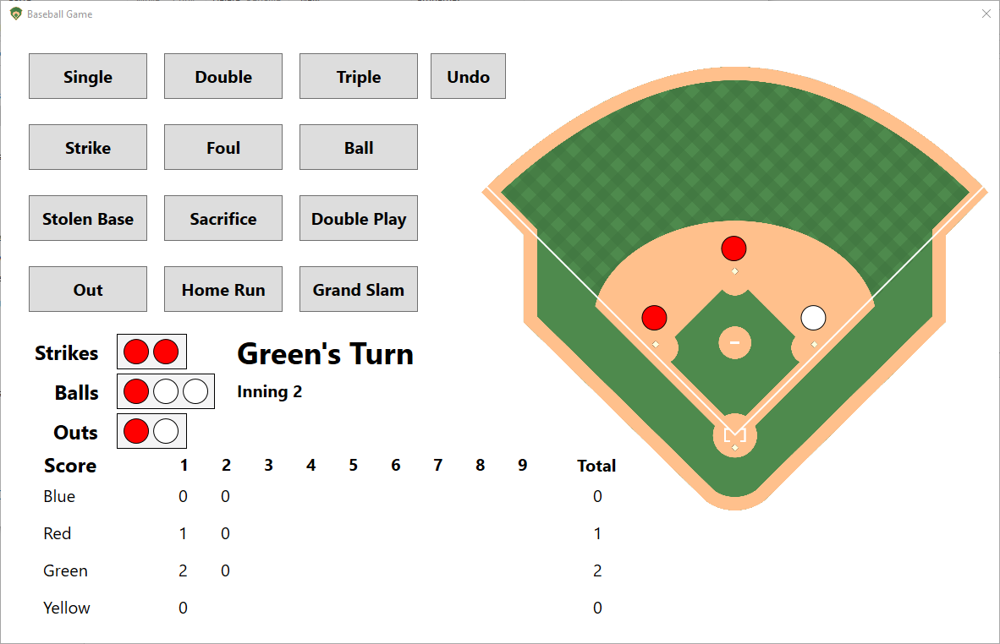

# Baseball_Game
A simple baseball game used for keeping track of score. More specifically, for the game of darts where the back side is a baseball game. 

To play the game, you must first have a dart board that looks something like . 

This game is taken in turns, where each player throws as many darts as it takes to get 3 outs. The rules pretty much follow normal baseball besides this. 

This app works best with a touchscreen, however the keyboard can be used as well. The bindings are setup to use the left-most 3 keys on the keyboard, aligned in the same way the buttons are in the app. For example: 1 is Single, 2 is Double, 3 is Triple; The next row: A is Strike, S is Foul, D is ball, etc. 

To run the program, you can compile from the source using Visual Studio 2017, or Windows users can use the executable provided below.

[Download the Baseball Game Here](CompiledGame/Baseball.exe)

Here is what it looks like in the middle of a game. 

